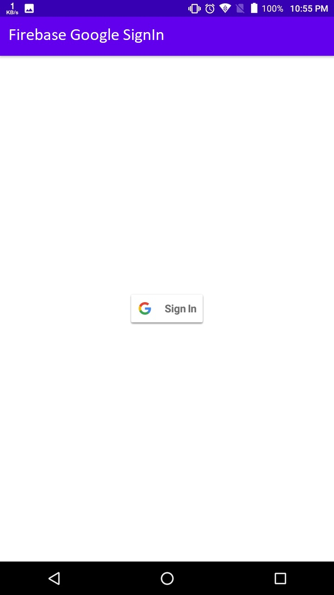

# Firebase_Google_SignIn
This app is for demonstration purpose which uses Google Sign in with Firebase for developers who want to integrate Google SignIn in their Android App

There are 2 pages in the app, one for signing in and other for signing out. To run this app in android studio you need to clone or download project. But app won't compile without a specific json file from firebase. So following are the steps required to get that file.

1) Open Firebase Console in browser, sign in and click on and project.

2) Write your project name and continue, if you enable Google Analytics finish setup accordingly or simply finish setup.
3) Select your newly created project, if you are already in, you will find multiple options on LEFT side of screen. Click on Authentication, in Develop section.
4) Click on Get Started in introduction. If your are on Users tab which is default, go on Sign In method, there you will find all authentication methods provided by firebase, click on Google and a popup dialog will appear. You have to fill 2 fields - 1. Project Name 2. Support Email. Support email is your email required by firebase. Fill them appropriately, and click SAVE. Your google sign in is enabled.
5) Go to your project in Android Studio and click on Tools in top pane. You will find Firebase option, click on that and assistant will pop up from right side. Select Authentication option there, then click on email and password authentication. You will find steps mentioned there of which 1st step is "Connect to Firebase", click on that which will open your default browser and firebase console, click on firebase project with which you want to connect your project then click on connect and let the process finish. Then follow step 2 and add dependencies required. 
6) Again go to Firebase console and go to Project Settings, scroll down there you will find "google-services.json" this is required file for project to run. Download that file.
7) Open Android Studio, on left side click on Project tab. Select view type as Project, click "app" folder and paste this JSON file there. Now you can build and run your project successfully.

If you follow this 7 steps you will not face any of the error.

If this project helps you, please give a star to it.

Thank you.
